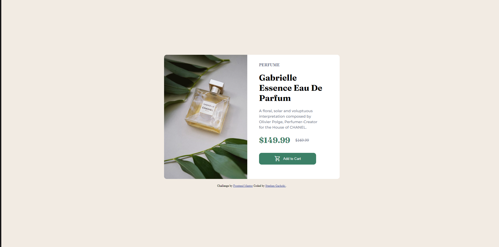

# Frontend Mentor - Product preview card component solution

This is a solution to the [Product preview card component challenge on Frontend Mentor](https://www.frontendmentor.io/challenges/product-preview-card-component-GO7UmttRfa). Frontend Mentor challenges help you improve your coding skills by building realistic projects.

## Table of contents

- [Overview](#overview)
  - [The challenge](#the-challenge)
  - [Screenshot](#screenshot)
  - [Links](#links)
- [My process](#my-process)
  - [Built with](#built-with)
  - [What I learned](#what-i-learned)
  - [Continued development](#continued-development)
  - [Useful resources](#useful-resources)
- [Author](#author)

## Overview

Product preview card component challenge has enabled me to practice my HTML and CSS skills.
This project is not too much challenging but it's educative at its capacity.

### The challenge

Users should be able to:

- View the optimal layout depending on their device's screen size
- See hover and focus states for interactive elements

### Screenshot



### Links

- Solution URL: [](https://www.frontendmentor.io/solutions/productpreviewcardcomponent-LOqNeDuNnI)
- Live Site URL: [Add live site URL here](https://product-preview-card-component-solution-three.vercel.app/)

### Built with

- Semantic HTML5 markup
- CSS custom properties
- Flexbox
- Mobile-first workflow
- [Styled Components](https://styled-components.com/) - For styles

### What I learned

1. That I can center a div using Flexbox.
2. For more responsiveness, you should use relative dimensions like percentages, em and rems.
3. I learnt how to import fonts and icons.
   To see how you can add code snippets, see below:

```html
<link
  rel="stylesheet"
  href="https://fonts.googleapis.com/css2?family=Material+Symbols+Outlined:opsz,wght,FILL,GRAD@20..48,100..700,0..1,-50..200"
/>
```

```css
@import url("https://fonts.googleapis.com/css2?family=Fraunces:opsz,wght@9..144,700&family=Montserrat:wght@500;700&display=swap");
```

### Continued development

1. Javascript.

## Author

- Website - [Stephen Gachoki](https://www.your-site.com)
- Frontend Mentor - [@Stegeek](https://www.frontendmentor.io/profile/Stegeek)
- Twitter - [@Steve_thedev](https://twitter.com/Steve_thedev)
